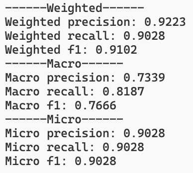

#### 运行环境：python3.7，具体看requirements.txt，在Google Colab上进行训练

# 运行步骤

- 先运行pre_process.py来做数据预处理（本数据集已附带经过预处理的结果文件，可以不跑此程序）

- bert模型下载（密码4cMG）：http://pan.iflytek.com/#/link/653637473FFF242C3869D77026C9BDB5

- 还需下载针对目标域的预训练权重（或者使用train.py自行训练得到权重）：https://drive.google.com/drive/folders/1-3p02yR4XNB1cGhZk1_H_1cwqojvEIYM?usp=sharing

- 最后使用eval.py验证，得到结果：
```
------Weighted------
Weighted precision: 0.9223
Weighted recall: 0.9028
Weighted f1: 0.9102
------Macro------
Macro precision: 0.7339
Macro recall: 0.8187
Macro f1: 0.7666
------Micro------
Micro precision: 0.9028
Micro recall: 0.9028
Micro f1: 0.9028
```
- 运行截图：

  
  
  # 思路
  
  根据所给将近一千项数据取出A2、A4、A5项，并提炼A5项的内容，例如将“xx市交通运输管理局”提炼为“交通 运输”，以达到降噪效果。以（A5，A2）和（A5，A4）两对数据为基准，并做数据增广（增加gt为0的数据），再训练BERT模型保存得到的权重。
  
  使用之前训练得到的权重加载BERT模型，计算得到测试集中（A5，A2）以及（A5，A4）的语义异常数据项。
  
  参考：
  
  - [无监督语义相似度哪家强？我们做了个比较全面的评测](https://kexue.fm/archives/8321)
  - [BERT4Keras](https://github.com/bojone/bert4keras)
  - [图解 BERT 预训练模型](https://zhuanlan.zhihu.com/p/279452588)
